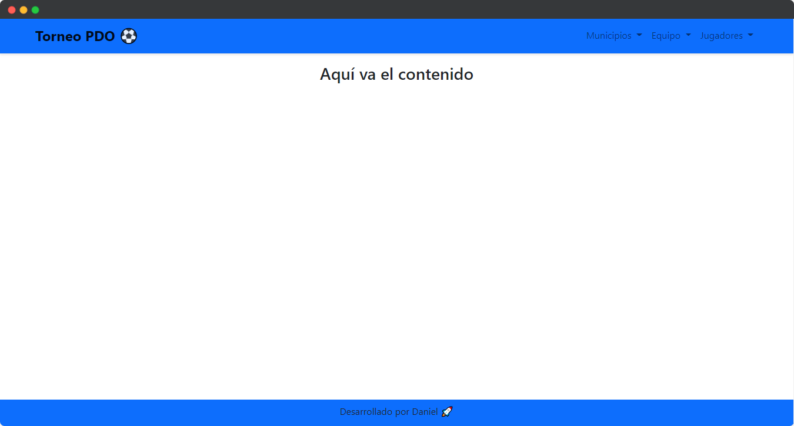
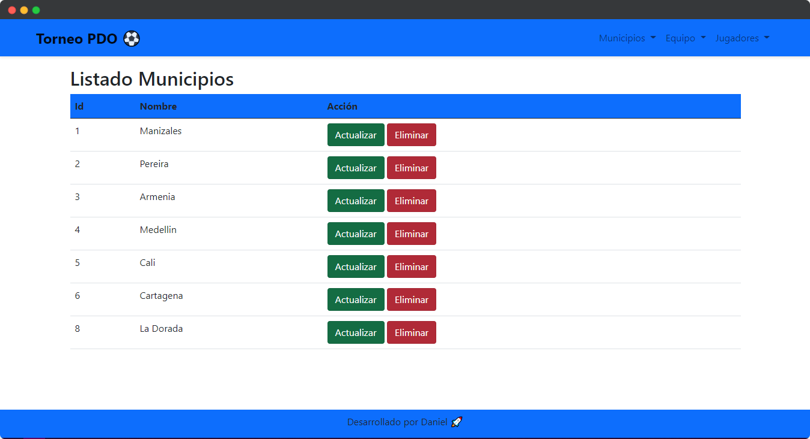

# Aplicación de PHP utilizando POO - MVC - PDO

En este repositorio va a ir la primera aplicación con bd conectada con la librería PDO
En la aplicación se simula un torneo de fútbol en el cual hay que agregar los equipos y los jugadores

## Algunas imagenes

